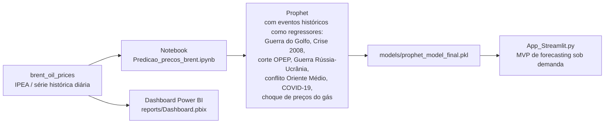

# 🛢️ Previsão do Preço do Petróleo Brent


🔗 **[Acesse o app ao vivo](https://brentoilprice-hs7hlppw4pfznvdxaappeoh.streamlit.app/)** (Streamlit Community Cloud)

##

## 🎯 Problema de negócio

Consultoria contratada por um cliente do segmento de energia para analisar a série histórica do preço do petróleo Brent (fonte: IPEA) e entregar:

1. Um **dashboard interativo** com storytelling e insights sobre a variação do preço (situações geopolíticas, crises econômicas, demanda global por energia).
2. Um **modelo de Machine Learning** para forecasting diário do preço (série temporal).
3. Um **MVP em produção** do modelo, via Streamlit.

## 🏗️ Arquitetura / Fluxo de dados



## ⚙️ Fases de execução

### 1. Ingestão
Série histórica diária do preço do petróleo Brent (data + preço em dólares), consolidada em `data/brent_oil_prices.csv`/`.xlsx`.

### 2. Transformação e modelagem
No notebook `notebooks/Predicao_precos_brent.ipynb`, a série é modelada com **Prophet**, incluindo como *holidays/regressores* uma lista de eventos históricos e geopolíticos relevantes para o preço do petróleo — Guerra do Golfo (1990), crise financeira de 2008, corte de produção da OPEP (2023), Guerra Rússia-Ucrânia (2023), conflito no Oriente Médio (2024), pandemia de COVID-19 (2020) e choque nos preços do gás (2021). Essa é a técnica central do projeto: em vez de tratar a série apenas como sazonal, o modelo incorpora explicitamente choques externos conhecidos.

### 3. Orquestração
Não há orquestração/agendamento neste projeto — é um MVP de forecasting sob demanda: o modelo é treinado no notebook, serializado (`models/prophet_model_final.pkl`) e carregado pelo app Streamlit a cada execução.

### 4. Visualização
- **Streamlit (`App_Streamlit.py`):** o usuário escolhe quantos dias prever (1-365), o app gera a previsão com o modelo Prophet salvo e exibe tabela + gráfico interativo (`plot_plotly`).
- **Power BI (`reports/Dashboard.pbix`):** dashboard com o storytelling e os insights sobre a variação histórica do preço, exigidos pelo enunciado do desafio.

## 🛠️ Stack técnica e por quê

| Camada | Tecnologia | Por quê |
|---|---|---|
| Modelagem de série temporal | **Prophet** | Lida bem com sazonalidade + permite modelar choques externos conhecidos via `holidays` |
| Manipulação de dados | **pandas** | ETL da série histórica |
| App / MVP | **Streamlit** | Deploy rápido do modelo como ferramenta interativa |
| BI | **Power BI** | Dashboard executivo com storytelling dos insights |
| Serialização | **joblib** | Persistência do modelo treinado |

## 💻 Como rodar localmente

> Prefere só testar sem instalar nada? Acesse a versão publicada: https://brentoilprice-hs7hlppw4pfznvdxaappeoh.streamlit.app/

```bash
git clone https://github.com/MichaelJourdain93/brent_oil_price.git
cd brent_oil_price

python -m venv .venv
source .venv/bin/activate   # Windows: .venv\Scripts\activate

pip install -r requirements.txt

streamlit run App_Streamlit.py
```

O dashboard executivo (`reports/Dashboard.pbix`) é aberto no Power BI Desktop.

## 📈 Resultados / Insights

- O preço do Brent é fortemente influenciado por choques externos identificáveis — o modelo incorpora explicitamente 7 eventos históricos (guerras, crises financeiras, decisões da OPEP, pandemia) como regressores, em vez de depender só de sazonalidade.
- O MVP permite forecasting configurável (1 a 365 dias) sob demanda, sem necessidade de retreinar o modelo a cada consulta.
- O storytelling completo com os insights sobre os principais fatores de variação do preço está no dashboard Power BI (`reports/Dashboard.pbix`).

## 🔭 Próximos passos

- [ ] Formalizar a comparação entre modelos (existia um script de comparação com bug nas métricas — foi removido nesta limpeza; vale refazer com backtesting correto, ex: `sklearn.model_selection.TimeSeriesSplit`)
- [ ] Automatizar a atualização da série histórica (hoje é um CSV/XLSX estático)
- [ ] Publicar o app Streamlit (Community Cloud) para demo sem instalação local
- [ ] Adicionar testes para a função de carregamento do modelo e geração de forecast

## 📁 Estrutura do projeto

```
brent_oil_price/
├── README.md
├── requirements.txt
├── App_Streamlit.py
├── notebooks/
│   └── Predicao_precos_brent.ipynb
├── data/
│   ├── brent_oil_prices.csv
│   └── brent_oil_prices.xlsx
├── models/
│   └── prophet_model_final.pkl
└── reports/
    └── Dashboard.pbix
```
